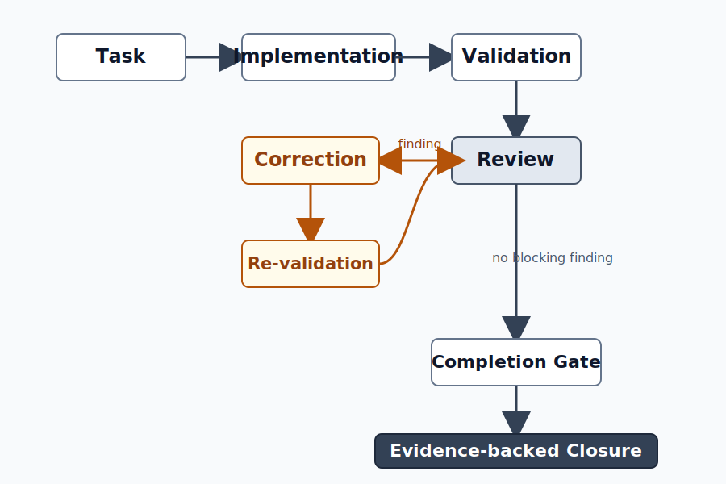

# AIWF

**Repository-native workflow governance for AI-assisted engineering**

AIWF is a lightweight, repository-native workflow governance layer for AI-assisted engineering work.
It helps engineering teams determine when AI-assisted work is actually ready to be considered complete.

AIWF records task metadata, validation, review, evidence, and finalize decisions inside the repository.
It makes completion claims reviewable, traceable, and reproducible without acting as a workflow engine or replacing human review.

<p align="center">
  
</p>

## Why AIWF?

AI can generate code, documentation, tests, and fixes.
Engineering teams still need evidence before they can confidently say that work is complete.
AIWF records workflow evidence inside the repository, making completion claims reviewable, traceable, and reproducible.

## What AIWF Is

| AIWF provides | AIWF is NOT |
|---------------|-------------|
| Workflow evidence governance | Workflow engine |
| Repository-native workflow records | Project management tool |
| Completion readiness checks | CI system |
| Deterministic workflow metadata | Coding agent |
| Evidence-driven finalize gate | Test runner |

AIWF does not guarantee correctness, decide whether product requirements are complete, or replace human review.

## Quick Start

Create a workflow task:

```bash
./aiwf new-task demo_task
```

Run readiness checks:

```bash
./aiwf check --path <task_dir>
./aiwf check --path <task_dir> --finalize-ready
./aiwf doctor --path <task_dir>
```

Finalize when evidence is ready:

```bash
./aiwf finalize --path <task_dir>
```

Use the task directory printed by `./aiwf new-task`.
If actual CLI syntax differs in your installed version, follow runtime help from `./aiwf --help`.

## Versioning

AIWF uses two independent version identifiers.

| Identifier | Represents |
|------------|------------|
| **AIWF Tool Version** | Runtime implementation, CLI behavior, packaging, bug fixes, security hardening, and internal architecture improvements |
| **Workflow Protocol Version** | Workflow semantics, workflow evidence model, state transitions, event semantics, completion boundary, and protocol compatibility |

Security fixes and implementation improvements normally update only the **AIWF Tool Version**.
The **Workflow Protocol Version** changes only when workflow semantics evolve.

Current metadata version boundary:

| Field | Value |
|-------|-------|
| Release version | `1.7.10` |
| AIWF Tool Version | `1.7.10` |
| Workflow Protocol Version | `1.7.8` |

## Documentation

### Core Boundaries

- AIWF core scope and domain boundary: [.aiwf/docs/repo_boundary.md](.aiwf/docs/repo_boundary.md)
- Canonical protocol semantics: [.aiwf/docs/workflow_protocol.md](.aiwf/docs/workflow_protocol.md)
- AI agent governance entrypoint: [.aiwf/docs/agent_rules/00_index.md](.aiwf/docs/agent_rules/00_index.md)

### Governance Docs

- Agent managed block integration: [.aiwf/docs/agent_integration.md](.aiwf/docs/agent_integration.md)
- Metadata attribution and profile rules: [.aiwf/docs/metadata.md](.aiwf/docs/metadata.md)
- Repository source packaging guideline: [.aiwf/docs/packaging.md](.aiwf/docs/packaging.md)

### Release Notes

- v1.7.0 release baseline: [.aiwf/docs/releases/v1.7.0.md](.aiwf/docs/releases/v1.7.0.md)
- v1.7.1 patch hardening: [.aiwf/docs/releases/v1.7.1.md](.aiwf/docs/releases/v1.7.1.md)
- v1.7.2 patch hardening: [.aiwf/docs/releases/v1.7.2.md](.aiwf/docs/releases/v1.7.2.md)
- v1.7.3 adoption foundation consolidation: [.aiwf/docs/releases/v1.7.3.md](.aiwf/docs/releases/v1.7.3.md)
- v1.7.4 release consistency and metadata artifact hygiene: [.aiwf/docs/releases/v1.7.4.md](.aiwf/docs/releases/v1.7.4.md)
- v1.7.5 deterministic task metadata hardening: [.aiwf/docs/releases/v1.7.5.md](.aiwf/docs/releases/v1.7.5.md)
- v1.7.5.post2 metadata attribution hardening: [.aiwf/docs/releases/v1.7.5.post2.md](.aiwf/docs/releases/v1.7.5.post2.md)
- v1.7.5.post3 metadata visibility and profile runtime option hardening: [.aiwf/docs/releases/v1.7.5.post3.md](.aiwf/docs/releases/v1.7.5.post3.md)
- v1.7.5.post4 metadata init inline allowed-values help: [.aiwf/docs/releases/v1.7.5.post4.md](.aiwf/docs/releases/v1.7.5.post4.md)
- v1.7.5.post5 metadata show compact source rendering: [.aiwf/docs/releases/v1.7.5.post5.md](.aiwf/docs/releases/v1.7.5.post5.md)
- v1.7.7 AIWF Upgrade Mechanism v1: [.aiwf/docs/releases/v1.7.7.md](.aiwf/docs/releases/v1.7.7.md)
- v1.7.8 shared date validation hardening: [.aiwf/docs/releases/v1.7.8.md](.aiwf/docs/releases/v1.7.8.md)
- v1.7.8.post1 public release baseline: [.aiwf/docs/releases/v1.7.8.post1.md](.aiwf/docs/releases/v1.7.8.post1.md)
- v1.7.9 Package Records evidence portability: [.aiwf/docs/releases/v1.7.9.md](.aiwf/docs/releases/v1.7.9.md)
- v1.7.10 filesystem trust-boundary security hardening: [.aiwf/docs/releases/v1.7.10.md](.aiwf/docs/releases/v1.7.10.md)
- Package Records release preparation: [.aiwf/docs/releases/package_records_release_preparation.md](.aiwf/docs/releases/package_records_release_preparation.md)

## Install AIWF in a New Repository

Audience: a clean repository that does not yet have the AIWF runtime, docs, templates, or managed AGENTS block.

Minimal flow:
```bash
mkdir -p .aiwf/bin .aiwf/docs .aiwf/templates
cp /path/to/new_aiwf_repo/aiwf ./aiwf
chmod +x ./aiwf
cp -R /path/to/new_aiwf_repo/.aiwf/bin ./.aiwf/
cp -R /path/to/new_aiwf_repo/.aiwf/docs ./.aiwf/
cp -R /path/to/new_aiwf_repo/.aiwf/templates ./.aiwf/
cp /path/to/new_aiwf_repo/.aiwf/config.yaml ./.aiwf/config.yaml
./aiwf agents install --path AGENTS.md --yes
```

Expected result:
- `./aiwf` resolves the canonical `.aiwf/bin/ai_workflow.py` runtime.
- `.aiwf/docs/` and `.aiwf/templates/` come from the same source package.
- root `AGENTS.md` has a managed block.
- task records are created under `.aiwf/records/ai_YYYYMMDD/`.
- project-level `docs/`, `tools/`, and `scripts/` remain project-owned and are not required by AIWF.
- AIWF install does not create, overwrite, or assume ownership of files under root `scripts/` unless explicitly requested for a project-specific integration.

Validation:
```bash
./aiwf --help
./aiwf upgrade --check --source /path/to/new_aiwf_repo
./aiwf agents check --path AGENTS.md
./aiwf new-task aiwf_install_smoke
./aiwf doctor --path <generated_task_path>
```

For a first install, `upgrade --check` is only a non-mutating package/layout consistency check.
Run `doctor` only after creating the first task and substituting its actual generated path.

Detailed guide: [.aiwf/docs/adoption_guide.md](.aiwf/docs/adoption_guide.md)

## Upgrade AIWF in an Existing Repository

Audience: a repository that already has AIWF files and needs a newer source package.

Minimal flow:
```bash
cp /path/to/new_aiwf_repo/aiwf ./aiwf
chmod +x ./aiwf
./aiwf upgrade --check --source /path/to/new_aiwf_repo
./aiwf upgrade --dry-run --source /path/to/new_aiwf_repo
./aiwf upgrade --apply --source /path/to/new_aiwf_repo
```

Expected result:
- `./aiwf`, `.aiwf/bin/ai_workflow.py`, and `.aiwf/docs/` come from the new source package.
- `.aiwf/records/`, `.aiwf/events/`, `.aiwf/migrations/`, and `.aiwf/config.yaml` are preserved.
- project-level `docs/`, `tools/`, and `scripts/` remain project-owned.
- existing project-owned files under root `scripts/` remain unchanged.
- legacy AIWF root `docs/` migration is disabled by default and runs only with explicit opt-in after reviewing ownership.

Validation:
```bash
./aiwf upgrade --check --source /path/to/new_aiwf_repo
./aiwf upgrade --dry-run --source /path/to/new_aiwf_repo
./aiwf agents check --path AGENTS.md
./aiwf check --path .aiwf/records/ai_YYYYMMDD/NNN_task_name --finalize-ready
```

Detailed guide: [.aiwf/docs/upgrading.md](.aiwf/docs/upgrading.md)

## Install vs Upgrade

| Repository state | Recommended path |
|---|---|
| No `aiwf` wrapper and no `.aiwf/` tree | First install |
| Root `aiwf` exists and `.aiwf/` exists | Upgrade |
| Legacy `docs/ai_*` layout exists | Upgrade / migration path |
| Partial or inconsistent layout | Run `./aiwf upgrade --check --source <source_repo>` and review blockers before `--apply` |

Command identity:
- `./aiwf` is the recommended user-facing and agent-facing repository-local command entrypoint.
- `.aiwf/bin/ai_workflow.py` is the canonical runtime implementation.
- AIWF owns only the root `./aiwf` entrypoint and the `.aiwf/` namespace.
- project-level `tools/ai_workflow.py`, when present in older repositories, is a project-owned legacy file. AIWF preserves it unchanged and does not use it as the supported public entrypoint.
- After confirming no external caller depends on a legacy `tools/ai_workflow.py`, users may remove it manually.
- `./aiwf` interpreter resolution order is:
  1. `AIWF_PYTHON`
  2. repo-local `.venv/bin/python`
  3. repo-local `.venv/Scripts/python`
  4. repo-local `.venv/Scripts/python.exe`
  5. `python` from `PATH`
  6. `python3` from `PATH` (validated as Python >= 3.10)
- Windows Store alias paths under `Microsoft/WindowsApps` are treated as non-runnable candidates and are skipped during fallback selection.

Records root layout:
- Canonical records root is `.aiwf/records`.
- Canonical AIWF docs root is `.aiwf/docs`.
- `.aiwf/config.yaml` declares the committed layout version:
  ```yaml
  aiwf_layout_version: 2
  docs_root: ".aiwf/docs"
  record_root: ".aiwf/records"
  event_log: ".aiwf/events/events.jsonl"
  legacy_enabled: true
  ```
- With this config, new task records are created under `.aiwf/records/ai_YYYYMMDD/`.
- Legacy `layout.records_root` is still accepted for compatibility in older repos.

Run a full lifecycle example:
- [.aiwf/docs/examples/basic_lifecycle.md](.aiwf/docs/examples/basic_lifecycle.md)

AGENTS root entrypoint helpers:
```bash
./aiwf agents print-block
./aiwf agents check --path AGENTS.md
./aiwf agents install --path AGENTS.md --yes
```

Root `AGENTS.md` is a thin managed bootstrap entrypoint. The managed block source of truth is [`.aiwf/templates/AGENTS.block.md`](.aiwf/templates/AGENTS.block.md). The canonical rules live under `.aiwf/docs/agent_rules/`, starting with [`.aiwf/docs/agent_rules/00_root_entrypoint.md`](.aiwf/docs/agent_rules/00_root_entrypoint.md).

### Version Metadata Policy (v1.7.10)
For this release, release identity and tool provenance advance to `1.7.10` while workflow protocol semantics remain at `1.7.8`.

Current metadata version boundary:
- release version: `1.7.10`
- tool version: `1.7.10`
- workflow protocol version: `1.7.8`

The upgrade mechanism is additive and does not imply a package manager, a database migration framework, or silent overwrites of workflow evidence.

## License

AIWF is licensed under the Apache License, Version 2.0. See [LICENSE](LICENSE).

## AIWF Metadata
`./aiwf metadata show` displays effective AI agent attribution metadata.
Effective metadata is resolved in this order:

```text
default -> active profile -> .aiwf/metadata.local.env -> shell env
```

`./aiwf metadata profile use <name>` changes `.aiwf/metadata.current`, but `.aiwf/metadata.local.env` or shell `AIWF_*` metadata variables may still override the active profile.

Use:

```bash
./aiwf metadata profile show
./aiwf metadata show
./aiwf metadata status
```

to inspect stored profile values, effective values, and metadata resolution behavior.

When all effective metadata fields resolve from the same source, `./aiwf metadata show` prints one shared `Source:` line. Mixed-source metadata continues to show per-field `from:` lines.

During `./aiwf metadata init`, enter `?` to show allowed values for the current field, or `:all` to print the full metadata allowed-values reference without leaving the prompt flow.

## AIWF v1.7.0 Release Semantics
- `finalize` is the closure point.
- Once finalized, new evidence records are rejected (for example `AIWF-FINALIZED-002`).
- If work is needed after finalize, create a follow-up task.
- `check --finalize-ready` is the recommended pre-finalize gate.
- v1.7.0 adds task-level pre-edit governance via `guard --pre-edit --path <task_dir>`.
- v1.7.0 remains evidence-driven for finalize semantics. Strict phase-gated finalize is still deferred.

### Agent Review Artifact Naming
New AIWF task records use `review_agent.md` as the canonical AI/agent review
artifact. Existing records that contain only `review_codex.md` remain supported
through a legacy alias and should not be bulk-renamed.

### Finalized Artifact Drift Governance (v1.7.x Clarification)
- AIWF does not guarantee physical immutability of finalized artifacts.
- AIWF governance guarantee is deterministic drift handling:
  - detect drift
  - diagnose scope/cause
  - repair via follow-up workflow task
  - preserve repair evidence
- Silent rewrite of finalized evidence is not allowed.
- If finalized artifact drift is found, use a dedicated repair task that records:
  - affected original task path/files
  - drift diagnosis
  - repair actions
  - post-repair consistency checks

### Guard Is Not Finalize
`guard --pre-edit` is a pre-edit governance guard. It does not replace:
- `check --finalize-ready`
- validation evidence
- review
- `finalize`

`finalize` remains the closure authority.

### Task Naming Reviewability Note
For future task naming, avoid duplicated numeric prefixes where possible.

- Prefer: `005_aiwf_v1_7_0_post_merge_baseline_review`
- Avoid: `001_005_aiwf_v1_7_0_post_merge_baseline_review`

Existing finalized task paths should not be renamed only for cosmetic cleanup.

## Diagnostics and Reporting
- Diagnostic code catalog: [.aiwf/docs/diagnostics.md](.aiwf/docs/diagnostics.md)
- Report usage and caveats: [.aiwf/docs/reporting.md](.aiwf/docs/reporting.md)

Report commands:
```bash
./aiwf report --path .aiwf/records --format json
./aiwf report --path .aiwf/records --format markdown
```

## New in v1.7.10

AIWF v1.7.10 is a runtime security hardening release for filesystem
trust-boundary handling.

This release hardens:

- public export symlink traversal under allowlisted roots
- review bundle symlinked task content
- upgrade source-package symlinked members
- review bundle output destinations under protected workflow evidence paths
- review bundle overwrite behavior, which now requires explicit `--force`

Normal public export, review bundle, and upgrade command syntax remains
unchanged. No workflow protocol semantic change, event schema change, or phase
state machine change is introduced.

## New in v1.7.9

AIWF v1.7.9 adds Package Records as an optional workflow evidence portability
capability:

```bash
./aiwf package records --output records.zip
```

The package includes a manifest, inventories, copied workflow records, event
evidence, optional dataset output, redaction metadata, and integrity metadata.
It is intended for workflow evidence analysis and engineering handoff, not as a
repository backup or source archive.

This release also introduces `review_agent.md` as the canonical agent review
artifact for new tasks while retaining `review_codex.md` as a legacy alias for
existing records.

No workflow protocol, event schema, or finalize behavior change is introduced.

## Package Records

Package Records creates a deterministic workflow evidence package for analysis,
review, and engineering handoff:

```bash
./aiwf package records --output records.zip
```

Additional examples:
```bash
./aiwf package records --output aiwf_records_package.zip
./aiwf package records --output aiwf-records-package --format directory
./aiwf package records --dry-run --output package_manifest.json
```

Package Records is:

- a workflow evidence package
- an analysis package
- an engineering handoff package

Package Records is not:

- a repository backup
- a source archive
- a tamper-proof audit ledger

The package contains `package_manifest.json`, summary and inventory files,
copied task records, canonical events, optional dataset output, and integrity
metadata. The default redaction profile is `safe`; use `--redaction-profile
internal` or `--redaction-profile none` only when the sharing boundary allows
it. Secret findings fail closed.

Package records output separates package status from source workflow evidence
quality. `Package Generation`, `Manifest Schema`, `Package Integrity`, and
`Privacy/Security` describe whether the package was produced safely. `Workflow
Evidence Findings` describes historical findings preserved from the packaged
records, and may be `WARNING` or `FAIL` even when package generation succeeded.

## AIWF Record Retention Policy
AIWF task records under `.aiwf/records/ai_YYYYMMDD/` are intended to be committed by default.
They are workflow evidence and part of the later reporting dataset.

Do not commit:
- secrets or private credentials
- private customer data
- large binary artifacts

Use sanitized summaries and external evidence references when required.

## Record and Knowledge Boundary
AIWF separates workflow execution evidence from derived knowledge and narrative material:

- `.aiwf/records/ai_YYYYMMDD/*`: workflow execution records, task lifecycle artifacts, validation/review/finalize evidence, and task-local `.aiwf/events.jsonl`.
- `.aiwf/docs/knowledge/*`: reusable operational engineering knowledge derived from tasks, such as patterns, repeatable bugs, and decisions. These files are not workflow execution records.
- `knowledge/analysis/*`: cross-task analysis, trend analysis, workflow interpretation, and comparative studies. Analysis is interpretation, not raw workflow evidence.
- `knowledge/articles/*`: public narrative material, article strategy, README strategy, and external communication drafts. Public narrative material must not be treated as protocol or runtime source of truth.

Source precedence:

```text
runtime code
  > protocol/design docs
  > release notes
  > workflow execution records
  > reusable engineering knowledge
  > derived analysis
  > public narrative material
```

Only `.aiwf/records/ai_YYYYMMDD/*` task records and task-local event logs should be used as raw workflow evidence.
Derived analysis, reusable knowledge, and public narrative material may summarize or interpret workflow evidence, but they must not override runtime behavior, protocol semantics, or recorded workflow evidence.

## Setup and Validation
Requirements:
- Python 3.10+ (or the repository-supported version)
- `pytest` for unit tests
- no runtime third-party dependency required for basic AIWF CLI behavior

This repository currently uses `requirement.txt` (not `requirements.txt`).

```bash
python -m venv .venv
source .venv/bin/activate
python -m pip install -r requirement.txt
python -m pytest -q
```

## Environment Policy
Use `.env.example` as the template for local overrides:

```bash
cp .env.example .env
```

## Adoption
For using AIWF in another repository:
- [.aiwf/docs/adoption_guide.md](.aiwf/docs/adoption_guide.md)
- [.aiwf/docs/examples/ci/gitlab-aiwf-minimal.yml](.aiwf/docs/examples/ci/gitlab-aiwf-minimal.yml)
